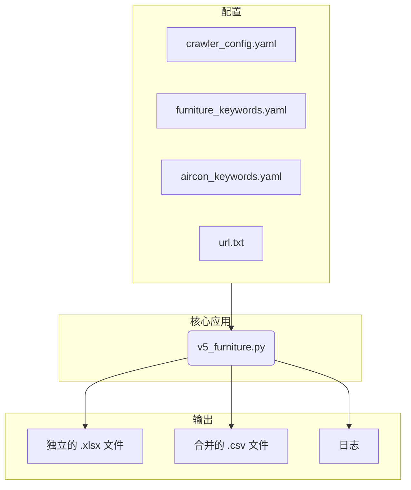

# 房地产列表爬虫与数据处理器

一个基于Python的网络爬虫，旨在从指定的URL抓取房地产列表，提取关键详情，并将数据处理成结构化格式（XLSX和CSV）。该项目高度可配置，允许用户通过YAML文件定义用于特征检测的关键字（例如，带家具的房产）和控制输出模式。

## 1. 问题背景

手动从各种网站收集和整理房地产列表数据是一项耗时、重复且容易出错的任务。房地产经纪人、分析师或潜在租户/买家等用户需要一种有效的方式来收集、比较和分析房产信息，而无需花费数小时进行手动数据输入。

## 2. 核心功能

- **网页抓取**: 从`config/url.txt`中提供的URL列表中抓取房产列表。
- **数据提取**: 提取详细的房产信息，包括地址、价格和描述。
- **特征识别**: 基于`config/furniture_keywords.yaml`和`config/aircon_keywords.yaml`中的可自定义关键字，识别家具和空调状况。
- **多种输出模式**:
  - `per_listing`: 为每个房产生成一个独立的XLSX文件。
  - `single_file`: 为所有房产创建一个合并的CSV文件。
  - `hybrid`: 同时执行以上两种模式。
- **高度可配置**: 核心行为通过`config/crawler_config.yaml`进行控制。
- **日志记录**: 记录抓取过程和错误以便于诊断。

## 3. 技术栈

- **语言**: Python 3.x
- **库**:
  - `requests`: 用于HTTP请求。
  - `BeautifulSoup4`: 用于HTML解析。
  - `pandas`: 用于数据操作。
  - `openpyxl`: 用于写入XLSX文件。
  - `PyYAML`: 用于配置管理。

## 4. 系统架构

该工具被设计为一个模块化的、配置驱动的脚本。核心逻辑读取外部YAML文件以实现灵活的、可自定义的执行。



## 5. 安装与运行

1.  **克隆仓库**:
    ```bash
    git clone <repository-url>
    ```
2.  **进入项目目录**:
    ```bash
    cd crawler-UTS-UYSD-UNSW/dist
    ```
3.  **安装依赖 (建议在虚拟环境中)**:
    ```bash
    pip install -r requirements.txt
    ```
4.  **配置爬虫**:
    - 编辑 `config/crawler_config.yaml` 设置输出模式和请求延迟等参数。
    - 在 `config/url.txt` 中添加目标URL（每行一个）。
    - 在 `config/furniture_keywords.yaml` 和 `config/aircon_keywords.yaml` 中自定义关键字。
5.  **运行脚本**:
    ```bash
    python v5_furniture.py
    ```
6.  **查找输出**:
    - 日志文件存储在 `crawler/logs/`。
    - 数据文件 (XLSX/CSV) 保存在 `crawler/data/`。

## 6. 配置文件详解

- **`config/crawler_config.yaml`**: 控制爬虫行为的主配置文件（例如，`output_mode`, `request_delay`）。
- **`config/furniture_keywords.yaml`**: 用于识别“带家具”房产的关键字列表。
- **`config/aircon_keywords.yaml`**: 用于识别“带空调”房产的关键字列表。

## 7. 未来路线图

- **增强的错误处理**: 提高对不同网站布局和反抓取措施的适应能力。
- **动态内容处理**: 增加对JavaScript渲染网站的支持（例如，使用Selenium/Playwright）。
- **GUI/Web界面**: 创建一个用户友好的界面来运行爬虫和查看结果。
- **高级数据分析**: 集成更复杂的数据分析或可视化功能。

## 8. 已知问题

- **历史日志警告**: 较早的日志文件可能显示关于 `furniture_keywords.yaml` 的 `FileNotFound` 警告。此问题已在最新版本的脚本中通过使用正确的相对路径得到解决。

## 9. 贡献

欢迎贡献！请随时提交拉取请求或开启一个问题。

## 10. 许可证

本项目根据MIT许可证授权。详情请见 `LICENSE` 文件。
