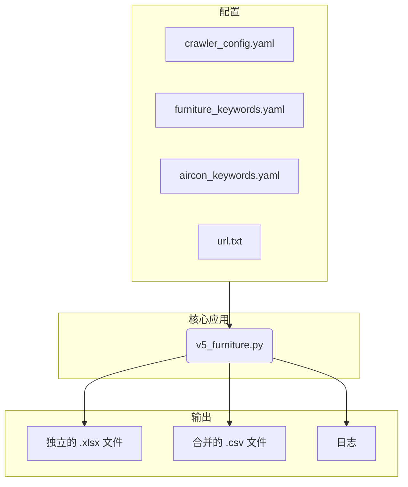

# 系统模式

## 1. 系统架构

该系统被设计为一个模块化的、基于脚本的应用程序，具有明确的关注点分离：

- **配置层**: `crawler/config/` 目录中的外部 `.yaml` 文件允许在不更改代码的情况下进行运行时自定义。这包括爬虫行为、特征关键字和目标URL。
- **核心逻辑 (`v5_furniture.py`)**: 这是包含 `DomainCrawler` 类的主脚本，该类负责协调整个过程。
- **数据处理与输出**: `BatchWriter` 类封装了处理数据缓冲和写入不同文件格式（XLSX、CSV）的逻辑。
- **日志记录**: 专用的日志设置提供诊断并跟踪爬虫的执行流程，日志保存到 `crawler/logs/` 目录。

## 2. 关键设计决策

- **配置驱动逻辑**: 关键业务逻辑，例如识别带家具的房产，由外部关键字列表驱动。这使得系统能够适应新的标准或不同的语言，而无需修改代码。
- **批处理**: `BatchWriter` 类使用内存缓冲区在写入文件之前收集数据。这对于 `hybrid` 和 `single_file` 模式是高效的，在这些模式下，来自多个页面的数据在写入最终的合并文件之前被聚合。
- **基于类的结构**: 核心逻辑被封装在类（`DomainCrawler`、`BatchWriter`）中，与纯过程式脚本相比，促进了代码的组织、可重用性和更简便的维护。
- **路径管理**: 使用 `pathlib` 处理文件系统路径，确保跨平台兼容性（例如，处理Windows与Linux的路径分隔符）。

## 3. 组件关系

- `v5_furniture.py` 从 `.yaml` 文件和 `url.txt` 中读取其配置。
- 根据配置，它抓取网站，处理数据，并生成输出文件（XLSX 和/或 CSV）和日志文件。